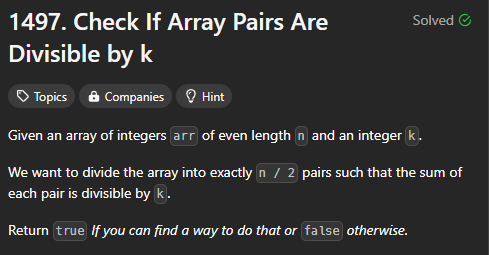

[Question Link](https://leetcode.com/problems/check-if-array-pairs-are-divisible-by-k/?envType=daily-question&envId=2024-10-01)

 
- First approach was to use hashmap

Understand basics maths.
 
- if we moudle any number k possible output be (0 to k-1)


Here we dont even have to go and check for all K's since if we check mp[rem]=mp[k-rem] so k/2 is can do the job for us


```
class Solution {
public:
    bool canArrange(vector<int>& arr, int k) {
        unordered_map<int,int>mp;
        for(int i=0;i<arr.size();i++){
            arr[i]=(arr[i]%k+k)%k;
        
        mp[arr[i]]++;
        }

        if(mp[0]%2!=0) return false;
        for(int i=1;i<=k/2;i++){
           if(mp[k-i]!=mp[i]  )
           return false;


        }
        return true;


    }
};

```

# Modulo condition to handle negative
```

  arr[i]=(arr[i]%k+k)%k;
 
@Note:

  (-4 % 5 + 5 ) % 5 =  1
 
```