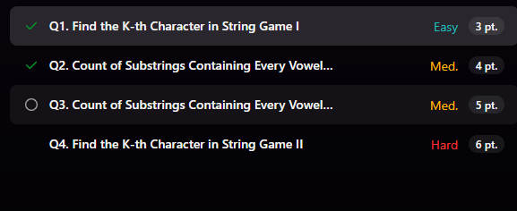
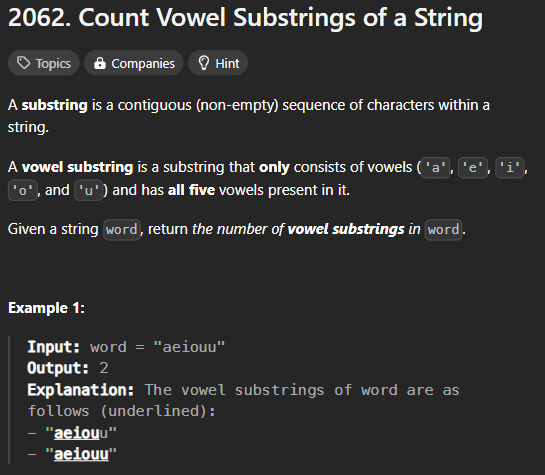

# Was able to solve 2 questions 🥹 though contest was really easy

- Before solving q3 lets solve other question to make go
  od foundation

  [Detailed Solution](https://leetcode.com/problems/count-vowel-substrings-of-a-string/solutions/1572798/c-o-n-2-to-o-n-detailed-explanation-with-picture)
  
  
