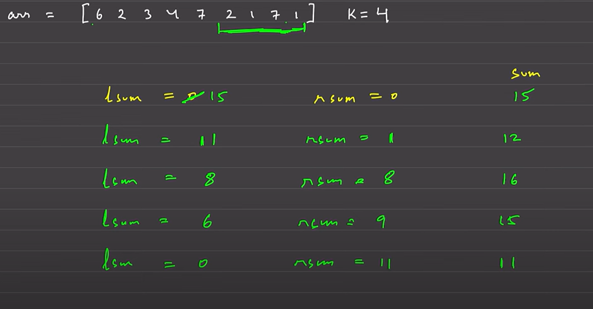

# There 2 types of problems in Sliding Window

1. Fixed size where condtion is given
2. Variable size like (largest/smallest subarray with condtion)
3. No of Subarrays with condition (toughest one out of three)
4. Shortest/Min window (condition)

# Fixed Window problems

[Maximum point leetcode](https://leetcode.com/problems/maximum-points-you-can-obtain-from-cards/) Consider first k elements as window then just move the window and start considering element from right side
initaly left_sum=sum of first k elements
- now we we start moving window so we start considering right_sum

