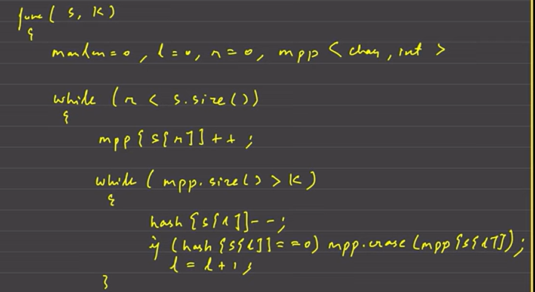
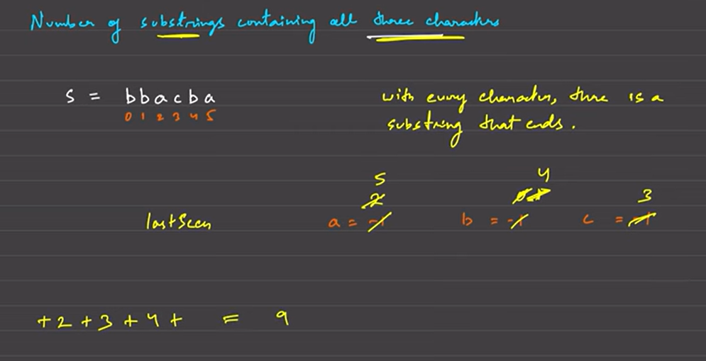

# There 2 types of problems in Sliding Window

1. Fixed size where condtion is given
2. Variable size like (largest/smallest subarray with condtion)
3. No of Subarrays with condition (toughest one out of three)
4. Shortest/Min window (condition)

# Fixed Window problems

[Maximum point leetcode](https://leetcode.com/problems/maximum-points-you-can-obtain-from-cards/) Consider first k elements as window then just move the window and start considering element from right side
initaly left_sum=sum of first k elements

- now we we start moving window so we start considering right_sum
  

[Longest Substring With At Most K Distinct Characters](https://youtu.be/teM9ZsVRQyc?feature=shared)



[1358. Number of Substrings Containing All
Three Characters](https://leetcode.com/problems/number-of-substrings-containing-all-three-characters/description/)
- For every character there is substring that ends      
- By using this logic we can find number of strings



## Solution
```
class Solution {
public:
    int numberOfSubstrings(string s) {
    int a=-1;
    int b=-1;
    int c=-1;
    int cnt=0;
    
        for(int i=0;i<s.size();i++){
            if(s[i]=='a')
            a=i;
            if(s[i]=='b')
            b=i;
            if(s[i]=='c')
            c=i;
            int minIndex=min({a,b,c});

            if(minIndex!=-1)
            cnt+=minIndex+1;
    }
    return cnt;
    }
};
```